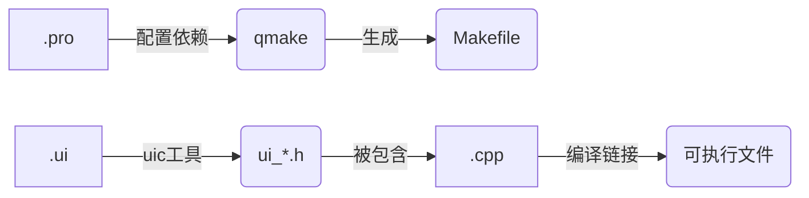

## Qt的优点
1. ​**全平台覆盖**​  
    📌 一套代码兼容Windows/macOS/Linux/Android/iOS及嵌入式系统
2. ​**友好学习曲线**​  
    🛠️ 简洁API设计，掌握后能快速迁移到其他GUI框架
3. ​**智能内存管理**​  
    ♻️ 基于对象树的**半自动回收机制**，平衡开发便利与运行效率
4. ​**高效开发工具链**​  
    ⚡ Qt Designer可视化设计 + QSS样式表，加速界面开发
5. ​**活跃技术生态**​  
    🌐 持续增长的开发者社区，Stack Overflow问题解决率超90%
6. ​**嵌入式领域优势**​  
    🔌 支持ARM架构，内存占用可优化至16MB以下（如Qt for Device Creation）
    
> 注："半自动垃圾回收"和"嵌入式开发"是Qt区别于Electron/Flutter等框架的核心竞争力.

## Qt开发环境

### C++ 编译器

  * **编译器与 IDE 的区别** ：编译器是 IDE 调用的一个程序，用于将代码转换为可执行文件。例如，gcc 和 cl.exe 都是 C++ 编译器，但它们不同于 IDE（如 Visual Studio）。
  * **内置编译器的优势** ：Windows 版本的 Qt SDK 内置了 C++ 编译器（mingw，即 Windows 版本的 gcc/g++）。使用内置编译器可以避免复杂的配置过程，减少出错的可能性，对于初学者来说更加友好。

### Qt SDK
  * **什么是 Qt SDK** ：Qt SDK 是软件开发工具包，它包含了开发 Qt 应用程序所需的核心库、工具和文档等资源。它是搭建 Qt 开发环境的基础组件。
  * **安装注意事项** ：在安装过程中，需要将对应的 C++ 编译器勾选上，以确保 SDK 能够正确地与编译器配合工作。

### Qt 集成开发环境（IDE）
  * **Qt 官方提供的 Qt Creator** (==最推荐==)
    * **优势** ：这是最容易入门的一种方式。它开箱即用，基本上不需要任何额外的配置，对于初学者非常友好。例如，当你下载并安装好 Qt SDK 后，Qt Creator 通常会自动配置好环境，你可以立即开始编写和运行 Qt 程序。
    * **缺点** ：虽然 Qt Creator 使用方便，但也存在一些 bug 可能会影响使用体验。不过，这些 bug 并不会严重阻碍你的开发进程。

  * **Visual Studio**
    * **优势** ：功能强大，适合需要更多高级特性和插件支持的开发者。有些公司在开发商业 Qt 程序时可能会选择使用 Visual Studio，因为它在团队协作和大型项目管理方面有独特的优势。
    * **缺点** ：需要额外的配置，包括安装 Qt 插件，并且需要将 Qt SDK 使用 Visual Studio 的编译器重新编译。这一步骤对于一些没有经验的开发者来说可能会比较复杂，容易出错。

  * **Eclipse**
    * **特点** ：Eclipse 本身是一个 IDE 平台，可以搭配不同的插件构成不同的 IDE。它不仅限于 Java 开发，在 C/C++ 开发领域也有一定的应用。不过，目前它的市场份额受到一些新型编辑器的冲击。

| 特性    | Qt Creator   | Visual Studio  | Eclipse+CDT |
| ----- | ------------ | -------------- | ----------- |
| 安装便捷度 | ★★★★★ (官方集成) | ★★★☆ (需单独配置Qt) | ★★☆ (需多插件)  |
| 调试能力  | ★★★★         | ★★★★★          | ★★★☆        |
| 界面设计器 | 原生支持         | 需安装Qt VS Tools | 需配置插件       |
| 跨平台支持 | 全平台          | Windows为主      | 全平台         |
| 适合场景  | 中小项目/跨平台开发   | 大型Windows项目    | 企业级扩展项目     |

实际上，搭建 Qt 开发环境并不一定需要分别安装这三个部分。你只需要安装一个 Qt SDK，通常它会包含 C++ 编译器和 Qt Creator 这样基本的 IDE 工具，这样就可以快速开始你的 Qt 开发之旅了。

相比之下，搭建 Java 环境需要 JDK（Java 开发工具包）和 IDE。这说明不同编程语言的开发环境搭建各有侧重，但 Qt 开发环境的集成度相对较高，对初学者来说更加方便。

## Qt下载
[Try Qt | Develop Applications and Embedded Systems | Qt](https://www.qt.io/download-dev)

> 教安装的教程很多, 这里不过赘述 , **特别注意安装软件的时候，所在的目录，不要带中文，不要带特殊符号，也不要带空格** , 并且记得配置环境变量.


## Qt 中的工具程序
Qt SDK 通常包含以下四个工具程序：
![[Pasted image 20250422225138.png]]

### 1. **Qt Creator**
- **功能概述**  
  Qt Creator 是 Qt 官方提供的集成开发环境（IDE）。它是一个功能强大的编辑器，专为 Qt 开发设计，支持代码编辑、调试、项目管理等功能。
- **优势**  
  - 开箱即用，无需额外配置。  
  - 提供智能代码补全、语法高亮、代码导航等，极大提高开发效率。  
  - 内置调试器，支持多平台开发（Windows、Linux、macOS）。  
- **适用场景**  
  适合初学者快速上手，也适合专业开发者进行大型项目开发。

### 2. **Assistant**
- **功能概述**  
  Assistant 是 Qt 的文档浏览器，用于查看 Qt 的官方文档和帮助文件。它帮助开发者快速查找类、函数、示例代码等信息。
- **优势**  
  - 可以本地浏览详细的 Qt 文档，无需联网。  
  - 支持关键词搜索和书签功能，方便快速定位内容。  
- **适用场景**  
  当开发者需要查阅 Qt 类库的用法、API 说明或示例代码时，使用 Assistant 可以大大提高效率。

### 3. **Designer**
- **功能概述**  
  Designer 是一个可视化 UI 设计工具，允许开发者通过拖拽控件（如按钮、文本框等）来设计用户界面。设计好的界面会生成 `.ui` 文件，Qt Creator 可以将其编译为 C++ 代码。
- **优势**  
  - 所见即所得的界面设计，无需手动编写 UI 布局代码。  
  - 支持信号与槽的可视化配置，简化 GUI 逻辑开发。  
- **适用场景**  
  适合快速设计复杂的用户界面，尤其是需要频繁调整布局的场景。

### 4. **Linguist**
- **功能概述**  
  Linguist 是 Qt 的国际化（i18n）工具，用于实现多语言支持。它帮助开发者创建和管理翻译文件（`.ts` 文件），将应用程序的文本内容翻译为不同语言。
- **优势**  
  - 支持多人协作翻译项目。  
  - 提供可视化翻译界面，方便非技术用户参与翻译工作。  
- **适用场景**  
  适用于需要将应用程序本地化为多种语言的开发者。


这四个工具共同构成了 Qt 开发的核心生态：
- **Qt Creator** 是主要的开发环境，用于编写和调试代码。  
- **Assistant** 提供文档支持，帮助开发者快速查阅 API。  
- **Designer** 负责可视化设计界面，减少手工编码的工作量。  
- **Linguist** 支持多语言开发，方便扩展国际市场。

如果你是初学者，建议从 **Qt Creator** 和 **Designer** 开始，先掌握基本的界面设计和代码开发流程，再逐步学习文档查阅（Assistant）和国际化（Linguist）的高级功能。

## 创建项目
在Qt Creator欢迎界面点击「Create Project」，选择「Qt Widgets Application」模板。这是开发桌面GUI应用的标准选择，将自动生成：
- 主窗口类框架代码（.h/.cpp）
- 可视化设计文件（.ui）
- 基础项目配置文件（.pro）  
    _注意：Qt Quick用于移动端/QML开发，此处应选Widgets_
![[Pasted image 20250422213831.png|402]]


![[Pasted image 20250422214002.png|437]]
![[Pasted image 20250422214337.png|404]]
1. ​**项目名称**​：使用无空格命名（如`Hello_QT`）
2. ​**存储路径**​：建议选择纯英文路径（避免中文或特殊符号）
3. ​**构建系统**​：
    - 选择「qmake」（Qt官方维护，适合新手）
    - 高级用户可选CMake（需手动配置）

>建议：Windows平台优先使用MinGW编译器，保持与Qt库兼容性


![[Pasted image 20250422214931.png|396]]
- Class name: MainWindow  主窗口类名（可自定义）
- Base class: QMainWindow 继承自Qt主窗口基类
- Header/Source: 自动生成头文件和实现文件  
- Form file: 勾选生成可视化设计文件（.ui）可以使用Qt Designer或者直接使用Qt Creator来编辑这个ui文件从而以图形化的方式快速方便的生成图形界面.

>_注意：QMainWindow提供菜单栏/状态栏等标准组件，QWidget适合自定义窗口_


![[Pasted image 20250422215043.png|405]]
选择「Translation File」时可暂不配置（后续开发完成后再添加多语言支持）。该功能用于：
- 通过`tr()`函数包裹待翻译文本
- 使用Qt Linguist生成翻译文件（.ts）  

>_建议：小型项目可跳过，中大型项目建议早期规划多语言_


![[Pasted image 20250422215143.png]]
- ​**Debug版**​：包含调试符号，适合开发阶段
- ​**Release版**​：优化代码体积，用于最终部署  
- 
>_常见问题：若未显示套件，需检查Qt版本与编译器匹配性_

![[Pasted image 20250422220833.png]]


## 文件剖析
![[Pasted image 20250422215405.png]]

```tree
Hello_QT/  
├── Hello_QT.pro       # 项目核心配置文件
├── 头文件/  
│   └── mainwindow.h   # 主窗口类声明
├── 源文件/  
│   ├── main.cpp       # 程序入口
│   └── mainwindow.cpp # 主窗口功能实现
└── 界面文件/  
    └── mainwindow.ui  # 可视化界面设计文件
```

## pro文件剖析
```qmake
QT       += core gui        # 启用的Qt模块
greaterThan(QT_MAJOR_VERSION, 4): QT += widgets  # 兼容Qt5+的控件库

CONFIG += c++17 # 启用C++17标准

TARGET = Hello_QT           # 生成的可执行文件名
TEMPLATE = app               # 项目类型（应用程序）

SOURCES += main.cpp \        # 源码文件列表 , 描述了当前项目中，，参与构建的文件列表
           mainwindow.cpp

HEADERS += mainwindow.h      # 头文件列表, 这个地方不需要手动修改.Qt Creator会自动维护

FORMS += mainwindow.ui       # 界面文件列表
```
​**关键作用**​：
- 定义编译器需要的包含路径
- 配置第三方库链接（如`LIBS += -lmath`）
- 控制平台特定编译选项（通过`win32`/`unix`条件判断）


### `mainwindow.h`（类声明文件）
```cpp
#ifndef MAINWINDOW_H
#define MAINWINDOW_H

#include <QMainWindow>  // 继承自Qt主窗口基类

QT_BEGIN_NAMESPACE
namespace Ui { class MainWindow; }  // 前置声明界面类
QT_END_NAMESPACE

class MainWindow : public QMainWindow //创建对象时选择的父类, Qt SDK中内置的 , 要想使用, 就必须包含对应的头文件 (如:#include <QMainWindow>)
{
    Q_OBJECT  // 必须的宏，启用元对象系统, 宏展开后就生成一大堆代码, 要想使用"信号和槽"就需要引入这个宏

public:
    MainWindow(QWidget *parent = nullptr);
    ~MainWindow();

private:
    Ui::MainWindow *ui;  // 指向界面元素的指针, 和 form file文件密切相关
};
#endif // MAINWINDOW_H
```

​**设计规范**​：
- 使用`#ifndef`防止头文件重复包含 (现在开发中最常用的还是`#pragma once`)
- 通过命名空间隔离界面类（`Ui::MainWindow`）
- `Q_OBJECT`宏启用信号槽等高级特性(==这个非常重要==)

>Qt的设定，使用Qt中内置的类，包含的头文件的名字就是和类名一致的
>当然，也不是用到的所有的Qt的类都需要显式包含头文件.C++中,头文件可能是"间接包含的"
>
>比如,引入了 a.h，a.h 里又包含了 b.h 此时,就相当于把 a.h 和b.h 都包含了.
>
>后续写代码的原则，一个Qt的类，先拿过来用.如果直接能用，说明对应的头文件已经被间接包含过了 , 无需显式包含
>
>如果这个类提示找不到定义啥的.手动的显式的吧对应的头文件给包含一下就行了.

### `main.cpp`（程序入口）

```cpp
#include "mainwindow.h"
#include <QApplication>  // 应用生命周期管理

int main(int argc, char *argv[])
{
    QApplication a(argc, argv);  // 每个Qt程序必须有且只有一个. 编写Qt图形化程序, 一定需要QApplication对象
    MainWindow w; // 创建项目时生成的类名
    w.show();  // 创建一个控件对象，并显示出来.show()方法让控件显示出来.hide()方法让控件隐藏
    return a.exec();  // 使程序跑起来
}
```

​**执行流程**​：
1. 创建应用对象（管理事件循环）
2. 实例化主窗口
3. 调用`show()`显示窗口
4. `exec()`启动事件处理（直到窗口关闭）


### `mainwindow.cpp`（功能实现）
```cpp
#include "mainwindow.h"  //创建项目时生成的头文件
#include "ui_mainwindow.h"  // 由.ui文件自动生成

MainWindow::MainWindow(QWidget *parent)
    : QMainWindow(parent)
    , ui(new Ui::MainWindow)  // 创建界面实例
{
    ui->setupUi(this);  // 将设计的界面附加到当前窗口
}

MainWindow::~MainWindow()
{
    delete ui;  // 释放界面资源
}
```

​**重要机制**​：
- `ui->setupUi(this)`将.ui文件中的布局实例化
- 自动生成的`ui_mainwindow.h`包含所有控件对象指针（如`ui->pushButton`）

### `mainwindow.ui`（界面蓝图）
当直接双击ui文件，此时QtCreator就会调用QtDesigner,打开ui文件.  

图形化的界面编辑器.
![[Pasted image 20250423141748.png|479]]


若再点击左侧栏的编辑按钮,就可以看到相应的XML页面
![[Pasted image 20250423141914.png|229]]

>什么是XML?
>**XML（eXtensible Markup Language，可扩展标记语言）​**​ 是一种用于存储和传输数据的通用标记语言，具有以下核心特点：
>1. ​**结构化数据**​  
>    通过自定义标签（如 `<book>`、`<price>`）分层组织内容，适合配置文件（如Qt的`.ui`文件）、Web服务（SOAP）等场景。
>2. ​**平台无关性**​  
>    纯文本格式，任何系统均可解析，是跨平台数据交换的标准（如Android布局文件）。
>3. ​**可扩展性**​  
    用户可自由定义标签和结构（对比HTML的固定标签）。

Qt中使用xml文件就是去描述程序的界面是啥样的进一步的qmake会调用相关的工具，依据这个xml文件生成一些C++代码，从而把完整的界面构造出来.

```xml
<?xml version="1.0" encoding="UTF-8"?>
<ui version="4.0">
 <class>MainWindow</class>
 <widget class="QMainWindow" name="MainWindow">
  <property name="geometry">
   <rect>
    <x>0</x>
    <y>0</y>
    <width>800</width>
    <height>600</height>
   </rect>
  </property>
  <property name="windowTitle">
   <string>MainWindow</string>
  </property>
  <widget class="QWidget" name="centralwidget"/>
  <widget class="QMenuBar" name="menubar"/>
  <widget class="QStatusBar" name="statusbar"/>
 </widget>
 <resources/>
 <connections/>
</ui>
```

​**设计器特性**​：
- 可视化拖拽布局控件
- 右键控件可直接转到槽函数
- 支持实时样式预览（QSS）
- 编译时由uic工具生成`ui_*.h`文件





## Hello World (控件实现)
![[Pasted image 20250423143559.png]]

此时在ui文件的xml中就会多出这么一段代码L17-L29
```xml newline:17-29
<?xml version="1.0" encoding="UTF-8"?>
<ui version="4.0">
 <class>MainWindow</class>
 <widget class="QMainWindow" name="MainWindow">
  <property name="geometry">
   <rect>
    <x>0</x>
    <y>0</y>
    <width>800</width>
    <height>600</height>
   </rect>
  </property>
  <property name="windowTitle">
   <string>MainWindow</string>
  </property>
  <widget class="QWidget" name="centralwidget">
   <widget class="QLabel" name="label">
    <property name="geometry">
     <rect>
      <x>230</x>
      <y>140</y>
      <width>91</width>
      <height>21</height>
     </rect>
    </property>
    <property name="text">
     <string>Hello World</string>
    </property>
   </widget>
  </widget>
  <widget class="QMenuBar" name="menubar">
   <property name="geometry">
    <rect>
     <x>0</x>
     <y>0</y>
     <width>800</width>
     <height>17</height>
    </rect>
   </property>
  </widget>
  <widget class="QStatusBar" name="statusbar"/>
 </widget>
 <resources/>
 <connections/>
</ui>

```


此时运行程序可以看到效果
![[Pasted image 20250423144611.png|379]]

## Hello World (代码实现) 
在mainwindow.cpp中编写代码
```cpp
#include "mainwindow.h"
#include "ui_mainwindow.h"

#include <QLabel>

MainWindow::MainWindow(QWidget *parent)
    : QMainWindow(parent)
    , ui(new Ui::MainWindow)
{
    ui->setupUi(this);
    //QLabel label;
    QLabel* label = new QLabel(this); // 为什么使用指针?
    label->setText("Hello World");

}

MainWindow::~MainWindow()
{
    delete ui;
}
```

运行结果
![[Pasted image 20250423145130.png|460]]

>为什么使用Label* label = new QLabel(this) , 而不是 Label label创建对象呢?
>这一切都是因为Qt 的**对象树（Object Tree）管理策略**是其核心内存管理机制，通过父子关系自动管理对象生命周期，避免内存泄漏。

### 动态创建对象的好处
在 Qt 中，推荐使用 `QLabel* label = new QLabel(this);`（动态创建对象）而不是 `QLabel label;`（栈上创建对象），主要有以下几个原因：

#### ​**1. 对象生命周期管理**​
- ​**动态创建（`new QLabel(this)`）​**​
    - 对象生命周期由 ​**Qt 的父子对象机制**​ 自动管理。
    - 当父对象（如窗口 `this`）被销毁时，所有子对象（如 `label`）也会被自动删除，​**避免内存泄漏**。
    - 适用于长期存在的对象（如 UI 控件）。
- ​**栈上创建（`QLabel label;`）​**​
    - 对象在作用域（如函数、代码块）结束时自动销毁。
    - 如果父窗口仍在运行，但 `label` 已销毁，会导致**悬空指针**或程序崩溃。
    - 仅适用于短期使用的临时对象。

#### ​**2. UI 控件的层级关系**​
- Qt 的 UI 控件（如 `QLabel`、`QPushButton`）通常需要**嵌入到父容器**​（如窗口、布局）中。
- 通过 `new QLabel(this)` 并指定父对象（`this`），可以：
    - 自动将控件添加到父对象的子组件列表。
    - 确保控件随父对象一起显示、隐藏或销毁。
    - 支持布局系统（如 `QVBoxLayout`）动态调整。
#### ​**3. 动态性与灵活性**​
- 动态创建允许在运行时**动态添加/删除控件**​（例如根据用户操作生成新标签）。
- 栈对象无法灵活扩展（大小和生命周期固定）。

#### ​**4. Qt 的设计哲学**​
- Qt 的整个框架基于**对象树（Object Tree）​**机制，依赖父子关系管理内存和事件。
- 动态分配是 Qt 的惯用方式，与信号槽机制、事件处理等深度集成。

#### ​**何时使用栈对象？​**​
- 极短生命周期的临时对象（如局部计算的中间变量）。
- 非 UI 组件（如 `QString`、`QList` 等值类型）。

​

|方式|生命周期管理|适用场景|
|---|---|---|
|`QLabel* = new QLabel(this)`|由父对象自动管理|UI 控件、长期存在对象|
|`QLabel label`|作用域结束时销毁|临时对象、非 UI 组件|

==Qt 推荐动态创建 UI 控件，以充分利用其**内存管理**和**对象树机制**，避免资源泄漏和逻辑错误。==


### 对象树
Qt 的**对象树（Object Tree）管理策略**是其核心内存管理机制，通过父子关系自动管理对象生命周期，避免内存泄漏。以下是关键要点：

#### ​**1. 核心机制**​
- ​**父子关系链**​：  
    每个 `QObject` 派生类（如窗口、按钮）可通过构造函数或 `setParent()` 指定父对象，形成层级树结构。
    ```cpp
    QLabel *label = new QLabel("Text", this); // this 是父对象
    ```
- ​**自动析构**​：  
    当父对象被销毁时，Qt 会**递归销毁所有子对象**​（无需手动 `delete`）。

#### ​**2. 核心规则**​
- ​**对象归属权**​：  
    父对象拥有子对象的所有权，子对象不能单独存在。
- ​**动态树结构**​：  
    支持运行时动态调整父子关系（如 `setParent(nullptr)` 解除关联）。
- ​**全局对象树**​：  
    所有对象可通过 `QObject::children()` 查询子对象列表。

#### ​**3. 实际应用场景**​
- ​**UI 控件管理**​：  
    窗口（`QWidget`）销毁时，自动释放其内部的按钮、标签等子控件。
    ```cpp
    QWidget *window = new QWidget;
    QPushButton *button = new QPushButton("OK", window); // 自动随 window 销毁
    ```
    
- ​**信号与槽安全**​：  
    对象树确保信号槽跨线程通信时，对象生命周期可控。

#### ​**4. 注意事项**​
- ​**避免环状引用**​：  
    父子对象循环引用会导致内存泄漏（需手动解除关系）。
- ​**非 `QObject` 类**​：  
    如 `QString`、`QList` 等值类型不适用此机制，需自行管理。

#### ​**5. 示例验证**
构建自己的MyLabel类
![[Hello Qt 2025-04-23 15.38.56.excalidraw]]

创建成功后会生成Mylabel.h与Mylabel.cpp文件
**这是mylabel.h生成的源代码**
```cpp
#ifndef MYLABEL_H
#define MYLABEL_H

#include <QLabel>

class MyLabel : public QLabel
{
public:
    MyLabel();
};

#endif // MYLABEL_H
```

>在QtCreator中，可以通过F4切换头文件和对应的.cpp文件.

**这是mylabel.cpp生成的源代码**
```cpp
#include "mylabel.h"
MyLabel::MyLabel()
{

}
```

但我们的Mylabel需要挂载到对象树上, 所以我们的需要对两个文件进行修改
**mylabel.h**
```cpp newline:10-11
#ifndef MYLABEL_H
#define MYLABEL_H

#include <QLabel>
#include <QMainWindow>

class MyLabel : public QLabel
{
public:
    MyLabel(QMainWindow* parent);  // 必须传递父对象指针
    ~MyLabel();  // 自定义一个析构函数，在析构函数中，完成打印方便咱们看到最终的自动销毁对象的效果!！!
};

#endif // MYLABEL_H
```

**mylabel.cpp**
```cpp newline:3-13
#include "mylabel.h"

#include <iostream>
MyLabel::MyLabel(QMainWindow* parent) //必须传入父窗口指针
    :QLabel(parent) // 用基类QLabel的构造函数，并传入父对象指针 . 关键作用：将此Label加入Qt对象树，由parent管理生命周期
{
    std::cout << "MyLabel construction" << std::endl;
}

MyLabel::~MyLabel()
{
    std::cout << "MyLabel deconstruction" << std::endl;
}
```
自定义一个析构函数，在析构函数中，完成打印方便咱们看到最终的自动销毁对象的效果!！!


接下来就是在**mainwindow.cpp**中创建并使用我们的的MyLabel对象
```cpp newline:13-15
#include "mainwindow.h"
#include "ui_mainwindow.h"
#include "MyLabel.h"

#include <QLabel>

MainWindow::MainWindow(QWidget *parent)
    : QMainWindow(parent)
    , ui(new Ui::MainWindow)
{
    ui->setupUi(this);
    //QLabel* label = new QLabel("Hello World" , this);
    MyLabel* ml = new MyLabel(this);
	 // MyLabel *label2 = new MyLabel(nullptr);  // 危险！必须手动管理
    ml->setText("hello MyLabel");
}

MainWindow::~MainWindow()
{
    delete ui;
}


```

运行项目
![[Hello Qt 2025-04-23 16.16.52.excalidraw]]

>**输出使用 `std::cout` 的注意事项**
> 使用`std::cout` 在应用程序输出台, 可能会出现乱码问题, 这是由编码问题导致. 最推荐使用`qDebug()`这个宏 , 使用方法:  `qDebug()`

Qt 对象树通过**自动化父子析构**和**层级管理**，显著简化了 C++ 内存管理，尤其适合动态 UI 开发。开发者只需关注对象关系，无需手动释放子对象。


## QT 的 STL
Qt因为历史原因,对C++的很多容器类重新进行了封装

在 Qt 中推荐使用Qt自带的容器类, 如(QString , QMap)