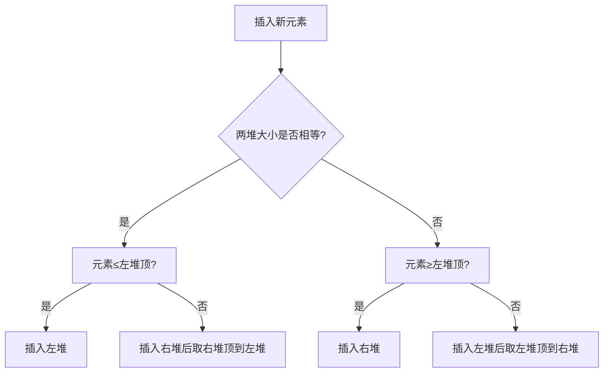

# 295. 数据流的中位数
[295. 数据流的中位数](https://leetcode.cn/problems/find-median-from-data-stream/)

## 题目描述
**中位数**是有序整数列表中的中间值。如果列表的大小是偶数，则没有中间值，中位数是两个中间值的平均值。

- 例如 `arr = [2,3,4]` 的中位数是 `3` 。
- 例如 `arr = [2,3]` 的中位数是 `(2 + 3) / 2 = 2.5` 。

实现 MedianFinder 类:

- `MedianFinder()` 初始化 `MedianFinder` 对象。
    
- `void addNum(int num)` 将数据流中的整数 `num` 添加到数据结构中。
    
- `double findMedian()` 返回到目前为止所有元素的中位数。与实际答案相差 `10-5` 以内的答案将被接受。
    

**示例 1：**

**输入**
["MedianFinder", "addNum", "addNum", "findMedian", "addNum", "findMedian"]
[[], [1], [2], [], [3], []]
**输出**
[null, null, null, 1.5, null, 2.0]

**解释**
MedianFinder medianFinder = new MedianFinder();
medianFinder.addNum(1);    // arr = [1]
medianFinder.addNum(2);    // arr = [1, 2]
medianFinder.findMedian(); // 返回 1.5 ((1 + 2) / 2)
medianFinder.addNum(3);    // arr[1, 2, 3]
medianFinder.findMedian(); // return 2.0

**提示:**

- `-10^5 <= num <= 10^5`
- 在调用 `findMedian` 之前，数据结构中至少有一个元素
- 最多 `5 * 10^4` 次调用 `addNum` 和 `findMedian`


## 解题思路

### 问题本质分析

需要动态维护一个数据流，并支持快速查询中位数。核心需求：

1. **高效插入**：插入操作的时间复杂度需尽可能低。
2. **快速查询**：中位数查询的时间复杂度应为 O(1)。
3. **动态平衡**：数据流不断变化，需实时调整数据结构以保持中位数可快速计算。

### 关键观察

1. **双堆结构**：使用大根堆保存较小的一半元素，小根堆保存较大的一半元素。
2. **平衡条件**：两个堆的大小差不超过1，保证中位数可直接通过堆顶计算。
3. **堆顶关系**：大根堆堆顶 ≤ 小根堆堆顶，确保数据有序性。

通过这种结构，中位数可以在 O(1) 时间内获得：
- 当两堆大小相等时，中位数为两堆顶的平均值。
- 当左堆更大时，中位数为左堆顶。

### 算法设计

#### 核心思路：双堆平衡法

1. **堆定义**：
    - `left`：大根堆，保存较小的一半元素。
    - `right`：小根堆，保存较大的一半元素。
2. **插入规则**：
    - 当两堆大小相等时，新元素插入后可能使左边多1个元素。
    - 当左边多1个元素时，新元素插入后需调整使两堆平衡。
3. **中位数计算**：
    - 两堆大小相等时，取两堆顶的平均值。
    - 左边多1个元素时，直接取左边堆顶。




## 代码实现

```cpp
#include <queue>
using namespace std;

class MedianFinder {
private:
    priority_queue<int> left; // 大根堆，保存较小的一半元素（堆顶为最大值）
    priority_queue<int, vector<int>, greater<int>> right; // 小根堆，保存较大的一半元素（堆顶为最小值）

public:
    MedianFinder() {} // 构造函数无需特殊操作

    void addNum(int num) {
        if (left.size() == right.size()) { // 两堆大小相等
            if (left.empty() || num <= left.top()) { 
                // 情况1：第一个元素或新元素属于较小半部分
                left.push(num);
            } else { 
                // 情况2：新元素属于较大半部分，需调整平衡
                right.push(num);
                left.push(right.top()); // 将右边的最小值移到左边
                right.pop();
            }
        } else { // 左堆比右堆多1个元素
            if (num >= left.top()) { 
                // 情况3：新元素属于较大半部分，直接加入右堆
                right.push(num);
            } else { 
                // 情况4：新元素属于较小半部分，需调整平衡
                left.push(num);
                right.push(left.top()); // 将左边的最大值移到右堆
                left.pop();
            }
        }
    }

    double findMedian() {
        if (left.size() == right.size()) {
            return (left.top() + right.top()) / 2.0; // 偶数个元素，取平均
        } else {
            return left.top(); // 奇数个元素，左堆顶即为中位数
        }
    }
};
```

### 复杂度分析

|操作|时间复杂度|空间复杂度|
|---|---|---|
|addNum|O(log n)|O(n)|
|findMedian|O(1)|O(1)|

- **时间复杂度说明**：
    - 每次插入操作最多涉及两次堆插入和一次堆删除，时间复杂度为 O(log n)
    - 查询操作直接访问堆顶，时间复杂度 O(1)
- **空间复杂度说明**：
    - 两个堆共存储 n 个元素，空间复杂度 O(n)


