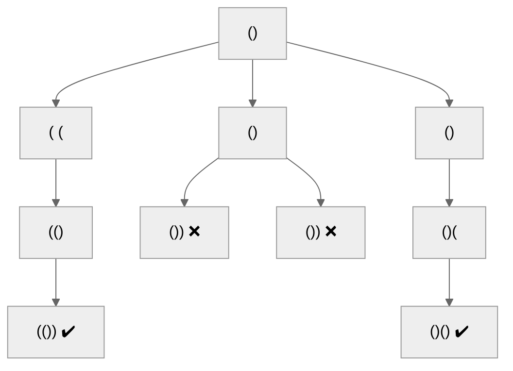

# 22. 括号生成
[22. 括号生成](https://leetcode.cn/problems/generate-parentheses/)

## 题目描述
数字 `n` 代表生成括号的对数，请你设计一个函数，用于能够生成所有可能的并且 **有效的** 括号组合。

**示例 1：**
**输入：** n = 3
**输出：**`["((()))","(()())","(())()","()(())","()()()"]`

**示例 2：**
**输入：** n = 1
**输出：**`["()"]`

**提示：**
- `1 <= n <= 8`

## 解题思路


本题目要求生成所有有效的括号组合，给定 n 对括号。有效括号组合需满足两个条件：
1. 左括号数量等于右括号数量（均为 n 个）
2. 任意前缀中左括号数量不少于右括号数量

通过回溯算法可以高效解决此类组合问题，以下是详细分析：

> [!question]+ 为什么选择回溯算法？
> 1. **路径构建**：每个位置都有选择左/右括号的可能性
> 2. **剪枝优化**：可以在无效路径出现时提前终止
> 3. **状态回溯**：需要尝试所有有效路径后恢复状态

#### 问题特征分析
1. **组合约束**：必须满足括号的合法嵌套关系
2. **双重限制**：
   - 总数限制：总括号数量为 2n
   - 顺序限制：右括号不能早于对应的左括号出现
3. **完全穷举**：需要生成所有可能的有效组合


#### 算法设计步骤
1. **定义状态变量**：
   - `left`：已使用的左括号数量
   - `right`：已使用的右括号数量
   - `path`：当前构建的括号字符串

2. **递归终止条件**：
   - 当右括号数量达到 n 时，保存有效组合

3. **递归选择策略**：
   - **左括号分支**：当左括号数量 < n 时可添加
   - **右括号分支**：当右括号数量 < 左括号数量时可添加

4. **回溯操作**：
   - 每次递归调用后恢复 `path` 和计数器状态


### 关键解析
1. **状态管理**：
   - `left` 和 `right` 严格记录使用数量，确保不越界
   - 先判断 `left < n` 再添加左括号，避免无效选择

2. **有效性保障**：
   - 右括号添加条件 `right < left` 确保任意前缀中左括号 ≥ 右括号
   - 两个 `if` 是独立判断，不是 `if-else` 关系，允许连续添加不同括号

3. **回溯三要素**：
   - **路径记录**：`path` 记录当前组合
   - **选择列表**：通过条件判断动态生成
   - **终止条件**：`right == n` 时组合完成

### 决策树示例（n=2）



## 代码实现
```cpp
class Solution {
    int left = 0, right = 0; // 当前左右括号使用计数
    string path;              // 当前括号组合
    vector<string> result;   // 存储所有有效组合
    
public:
    vector<string> generateParenthesis(int n) {
        dfs(n);
        return result;
    }

    // 回溯算法核心
    void dfs(int n) {
        // 终止条件：右括号用尽时保存结果
        if (right == n) {
            result.push_back(path);
            return;
        }

        // 左括号分支：当左括号未用尽时选择
        if (left < n) {
            path.push_back('(');  // 做出选择
            left++;               // 更新状态
            dfs(n);               // 递归探索
            path.pop_back();      // 撤销选择
            left--;               // 状态回退
        } 
        
        // 右括号分支：当右括号少于左括号时选择（确保有效性）
        if (right < left) {
            path.push_back(')');  // 做出选择
            right++;              // 更新状态
            dfs(n);               // 递归探索
            path.pop_back();      // 撤销选择
            right--;              // 状态回退
        }
    }
};
```

### 复杂度分析

**时间复杂度分析**
- 卡特兰数模型：结果数量为第 n 个卡特兰数 C(n) = (1/(n+1)) * C(2n, n)
- 时间复杂度：O(4^n / sqrt(n))，每个节点产生两个分支（有效剪枝后）

**空间复杂度分析**
- 递归栈深度：O(2n) → O(n)
- 结果存储空间：O(n * C(n))，每个字符串长度 2n


## 动态规划解法

1. **状态定义**
采用三维动态规划数组 `dp[i][j]`，其中：
• `i` 表示已使用的左括号数量
• `j` 表示已使用的右括号数量
• `dp[i][j]` 存储所有由i个左括号和j个右括号组成的有效括号组合

**关键性质**：在任何有效括号组合中，右括号数量 `j` 必须小于等于左括号数量 `i`，这保证了括号闭合的合法性。

2. **初始化**
初始状态为 `dp[0][0] = {""}`，表示0个括号时的组合为空字符串。这是所有有效括号组合的起点。

3. **状态转移**
通过逐步添加左括号或右括号来构建更大的有效组合：
• **添加左括号**：当 `i < n` 时，可以从 `dp[i][j]` 转移到 `dp[i+1][j]`。每个当前组合追加一个左括号。
• **添加右括号**：当 `j < i` 时，可以从 `dp[i][j]` 转移到 `dp[i][j+1]`。每个当前组合追加一个右括号。

**转移条件分析**：
• 左括号添加不受限，只要总数不超过n。
• 右括号必须在左括号数量之后，确保任何时候右括号数量不超过左括号。

4. **结果提取**
最终结果存储在 `dp[n][n]` 中，表示使用n个左括号和n个右括号的所有有效组合。

#### 正确性证明
通过动态规划的状态转移，我们保证了每一步添加括号后组合的有效性：
• 左括号优先积累，为后续右括号提供闭合基础。
• 右括号仅在数量足够左括号时添加，避免无效闭合。

### 复杂度分析
• **时间复杂度**：O($4^n / √n$)，每个状态生成需要线性时间，总状态数为卡特兰数。
• **空间复杂度**：O($n * 4^n / √n$)，存储所有中间组合。

### 代码实现
```cpp
class Solution {
public:
    vector<string> generateParenthesis(int n) {
        // dp[i][j]表示使用i个左括号和j个右括号的有效组合集合
        vector<vector<vector<string>>> dp(n + 1, vector<vector<string>>(n + 1));
        dp[0][0] = {""}; // 初始状态：无括号，空字符串
        
        // 遍历所有可能的左括号数量i
        for (int i = 0; i <= n; ++i) {
            // 右括号数量j不能超过i，保证合法性
            for (int j = 0; j <= i; ++j) { 
                // 添加左括号：当左括号未达上限时，可生成新状态
                if (i < n) {
                    for (string s : dp[i][j]) {
                        dp[i + 1][j].push_back(s + "("); // 添加左括号，转移至i+1,j
                    }
                }
                // 添加右括号：当右括号数量小于左括号时，可闭合
                if (j < i) {
                    for (string s : dp[i][j]) {
                        dp[i][j + 1].push_back(s + ")"); // 添加右括号，转移至i,j+1
                    }
                }
            }
        }
        return dp[n][n]; // 返回n对括号的所有有效组合
    }
};
```

### 总结
本解法通过动态规划系统地构建有效括号组合，避免了回溯法的重复递归，利用状态转移确保每一步的合法性。理解状态定义和转移条件是掌握此类问题的关键，适用于多种括号生成变种题目。
